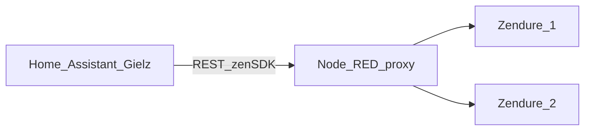

# Samenvatting: Zendure-zenSDK-proxy (gast777)

Bron: [gast777/Zendure-zenSDK-proxy](https://github.com/gast777/Zendure-zenSDK-proxy)

**Code staat niet in deze Fresh-R-repo.** Fork met uitbreiding (1–3 devices, async Node-RED): [hemertje/Zendure-zenSDK-proxy](https://github.com/hemertje/Zendure-zenSDK-proxy) — clone lokaal bijvoorbeeld naar `~/Development/Zendure-zenSDK-proxy`.

## Doel

De [Gielz-automatisering](https://github.com/Gielz1986/Zendure-HA-zenSDK) voor Zendure via Home Assistant ondersteunt normaal **één** omvormer. Deze Node-RED **proxy** laat **twee** Zendure-apparaten (bijv. 2× SolarFlow 2400 AC) samenwerken alsof het **één** device is: Home Assistant praat alleen met de proxy; de proxy verdeelt opdrachten over beide Zendures en balanceert laadpercentages.

## Wat zit er in de repo?

| Onderdeel | Functie |
| --------- | ------- |
| [Zendure-proxy-Node-Red-flow.json](https://github.com/gast777/Zendure-zenSDK-proxy/blob/main/Zendure-proxy-Node-Red-flow.json) | Te importeren Node-RED flow |
| [README.md](https://github.com/gast777/Zendure-zenSDK-proxy/blob/main/README.md) | Volledige instructies (NL), sensoren, optionele features |
| `images/` | Screenshots / uitleg |

## Installatie in het kort

1. **Node-RED**: Flow importeren; in het blok **"Vul hier de Zendure IP adressen in"** beide Zendure-IP’s invullen; **Deploy**.
2. **Home Assistant** (minimaal **maart 2026** Gielz ZenSDK): bij `input_text.zendure_2400_ac_ip_adres` het **proxy-adres** zetten, bijv. `192.168.x.x:1880` of bij relatieve URL’s `IP:poort/endpoint`; op de HA-host zelf vaak `localhost:1880/endpoint`.
3. **Vermogenslimieten**: `input_number.zendure_2400_ac_max_oplaadvermogen` en `max_ontlaadvermogen` bij 2×2400 bijvoorbeeld op **4800 W** (of lager indien gewenst).
4. **Node-RED add-on op HA**: README raadt aan SSL uit, optioneel `leave_front_door_open` aan, en het IP-veld naar `localhost:1880/endpoint` te configureren.

## Gedrag (kern)

- **Vermogensverdeling**: Opdracht van HA wordt slim verdeeld; bij verschil in SoC laadt de leegste sneller en ontlaadt de volste sneller zodat percentages bij elkaar blijven.
- **Single vs dual mode**: Bij **laag** vermogen vaak **één** device actief (efficiëntie); bij hoger vermogen **beide**; overgangen zijn in de flow uitgewerkt (o.a. 95/5-split bij opstart tweede device).
- **Proxy-API**: Extra attributen (per device SoC, vermogensopdrachten, `activeDevice`, optioneel demper/synchroon modi, enz.) voor monitoring in HA via REST-sensoren.

## Monitoring in Home Assistant

Tussen de aangegeven commentaarregels in de Gielz-package of `configuration.yaml` kunnen **REST-template sensoren** worden geplakt (Zendure 1/2 laadpercentage, vermogensopdrachten, actief device, temperaturen, serienummers, proxyversie, enz.). De upstream README bevat de volledige YAML en een voorbeeld **Entities**-dashboardkaart.

## Optionele features (README)

- **Dual Mode Demper**: Voorkomt dat bij korte ontladpieken onnodig dual mode wordt ingeschakeld (configureerbaar in de flow; optioneel HA-switch/automation).
- **Beide actief** / **Synchroon laden**: Geavanceerde modi om gedrag te forceren; voor de meeste gebruikers niet nodig.
- **Extra polling** rechtstreeks naar de Zendure-IP’s (laagfrequent) voor o.a. WiFi/error — niet de proxy, om devices niet te belasten.

## Vereisten en beperkingen

- **Vereist**: 2× compatibele Zendures, gelijke SoC-limieten en vergelijkbare opslag/vermogen waar mogelijk, **vaste IP’s**, goede WiFi.
- **Beperkingen**: DC-zonnepanelen direct op Zendure niet officieel getest; kleine restvermogen bij 0 W-opdracht is bekend Zendure-gedrag; Node-RED 4.0.9 had issues — 4.1.2+ wordt genoemd als werkend.

## Versie

Huidige proxyversie in de upstream README: **20260308** (release-notes beschrijven o.a. `batCalTime`, `gridReverse`, optionele solarPower-attributen, dual-mode demper, HTTP-optimalisaties).

---

## Fork 1×3 (async, review)

- **Repo:** [hemertje/Zendure-zenSDK-proxy](https://github.com/hemertje/Zendure-zenSDK-proxy) — zelfde upstream-basis als gast777, met extra flow `Zendure-proxy-Node-Red-flow-1x3-async.json` en `README-1x3.md` (`deviceCount` 1–3 via inject-knoppen in Node-RED).
- **PR naar upstream:** na push op de fork een pull request openen naar [gast777/Zendure-zenSDK-proxy](https://github.com/gast777/Zendure-zenSDK-proxy) (titel bijv. *Node-RED: 1–3 Zendures, async GET/POST + deviceCount*).

---

**Conclusie (upstream gast777):** De repo is **documentatie + één Node-RED JSON-flow** om de Gielz ZenSDK-setup uit te breiden naar **twee** Zendures via een **lokale proxy**, inclusief uitgebreide HA-sensorfragmenten en optionele geavanceerde schakelaars.
